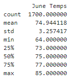
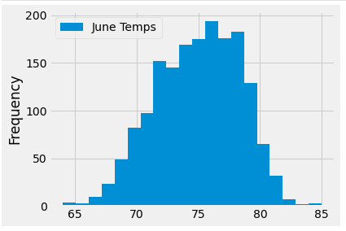
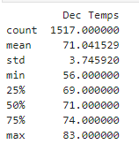
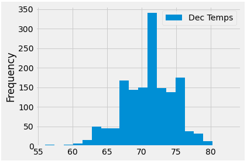

# surfs_up

## Overview

Use advanced data storage and retrieval to analyze temperature trends in Oahu, Hawaii in summer and winter months. Obtain a summary statistics of the temperature data captured for the months of June and December. Knowing temperature trends will allow potential businesses to determine whether it is worth opening up on Oahu and how it could potentially affect business throughout the year. 

## Analysis

### June

Summary Statistics for June

June Visualization of Temperature Readings and Frequency

### December

Summary Statistics for December

December Visualization of Temperature Readings and Frequency

